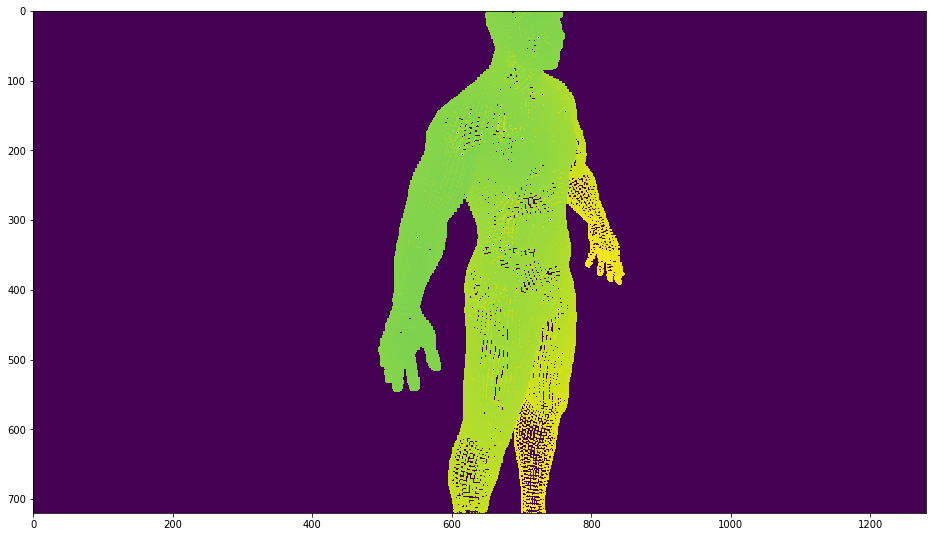
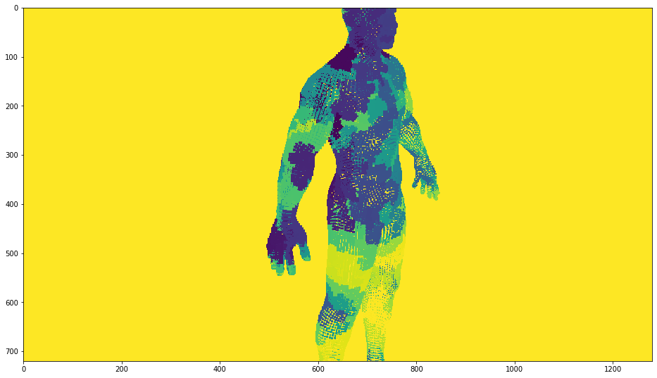

```python
import torch
import pcpr
import numpy as np
import matplotlib.pyplot as plt
```

## Prepare test parameters 


```python
# Load point cloud
vs = np.loadtxt('vertices.txt')
in_points = torch.Tensor(vs).cuda()

# Set camera parameters
K =torch.Tensor( [[1923.6, 0 ,640],[0, 1923.6, 360],[0, 0 ,1]]).cuda()
T = torch.Tensor([0.738746 ,-0.338934 ,-0.582562 ,0.619214 ,0.000001 ,0.785223 ,
                  -0.266138, -0.940810 ,0.209873 ,-32.617535 ,26.210785 ,23.938950]).cuda()

# Allocate output buffers
out_depth = torch.zeros(720,1280).cuda()
out_index = torch.zeros(720,1280, dtype = torch.int32).cuda()


```

## Invoke PCP Forward Render


```python
out_depth, out_index = pcpr.forward(in_points, K, T, out_depth, out_index, 40,50,2.5 )
```

## Invoke PCP Backward


```python
'''
grad_feature_image = torch.ones(1,128,720,1280).cuda()
out_index = out_index.view(1,720,1280)
num_points = torch.Tensor([vs.shape[0]]).int().cuda()
out_index = out_index-1
out_index[out_index<0] = num_points[0]

out_grad_feature_points = torch.zeros(128,vs.shape[0]).cuda()
out_grad_default_feature = torch.zeros(128,1).cuda()

print('grad_feature_image: ',grad_feature_image.size())
print('out_index: ',out_index.size())
print('num_points: ',out_index.size())
print('out_grad_feature_points: ',out_grad_feature_points.size())
print('out_grad_default_feature: ',out_grad_default_feature.size())

'''
grad_feature_image = torch.ones(2,128,720,1280).cuda()
out_index = torch.stack([out_index,out_index],dim=0)
num_points = torch.Tensor([vs.shape[0],vs.shape[0]]).int().cuda()

# rearrange index
out_index = out_index-1
out_index[out_index<0] = num_points[0]

out_grad_feature_points = torch.zeros(128,vs.shape[0]*2).cuda()
out_grad_default_feature = torch.zeros(128,1).cuda()

print('grad_feature_image: ',grad_feature_image.size())
print('out_index: ',out_index.size())
print('num_points: ',out_index.size())
print('out_grad_feature_points: ',out_grad_feature_points.size())
print('out_grad_default_feature: ',out_grad_default_feature.size())


```

    grad_feature_image:  torch.Size([2, 128, 720, 1280])
    out_index:  torch.Size([2, 720, 1280])
    num_points:  torch.Size([2, 720, 1280])
    out_grad_feature_points:  torch.Size([128, 48922])
    out_grad_default_feature:  torch.Size([128, 1])


```python
grad_points, grad_default = pcpr.backward(grad_feature_image, out_index, num_points,
                                          out_grad_feature_points, out_grad_default_feature, vs.shape[0]*2 )
```

## Visualization


```python

plt.figure(figsize=(16, 16))
plt.imshow(out_depth.cpu().numpy())
plt.figure(figsize=(16, 16))
plt.imshow(out_index[0].cpu().numpy())
```


    <matplotlib.image.AxesImage at 0x7fa73d2fb278>








```python
A = out_index[0].cpu().view(-1).int().numpy()
A.sort()
res = np.bincount(A)
res.sort()
print(res)
```

    [     0      0      0 ...     36     36 796384]


```python

```


```python

```


```python

```


```python

```
